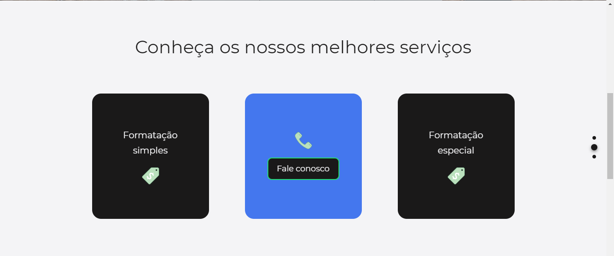

<a href="https://felipevgomes10.github.io/formater/">LINK DO PROJETO FORMATER</a>

# Fomater

Formater é um projeto de uma lading-page que consiste em captar clientes para um empresa fictícia que realiza formatação de diferentes tipos de documentos.

# Seções de site

A página é separada em três partes distintas sendo a primeira a seção que contém todos os links do site e sua aprensentação.


A segunda parte do projeto é a seção de serviços oferecidos aos cliente. Nessa parte do site foram criados três cards giratórios inteiramente feitos com CSS3.



A terceira e última parte do site é dividida em duas partes, sendo a primeira uma breve seção de comentários, onde clientes satisfeitos estão dando seus depoimentos. A segunda a parte é um breve formulário no qual o cliente colocará suas informações para contratar os serviços oferecidos pelo site.


# Responsividade

O projeto Formater é totalmente responsivo, funcionando nos mais variados tamanhos de tela. Para conferir todos os detalhes de perto acesse: <a href="https://felipevgomes10.github.io/formater/">LINK DO PROJETO FORMATER</a>.

# JavaScript

O projeto foi desenvolvido inteiramente com Javascript moderno, usando features de Javascript ES6+. Outro detalhe do projeto é que seu código Javascript foi totalmente separado em módulos para que houvesse uma maior manutenibilidade no mesmo.

# Efeitos JavaScript

O projeto conta com vários efeitos front-end feitos com vanilla Javascript. Alguns deles são: efeitos de scroll suave, efeito de máquina de escrever, efeito de fade nas seções do site de acordo com o scroll da página, dentre outros. Para conferir todos os efeitos acesse: <a href="https://felipevgomes10.github.io/formater/">LINK DO PROJETO FORMATER</a>.

# Iniciando o projeto

Durante o desenvolvimento do site, uma única dependencia foi utilizada, sendo ela a "node-sass", para instalá-la uso o seguinte código:

```
npm install
```
ou
```
npm install node-sass --save-dev
```
